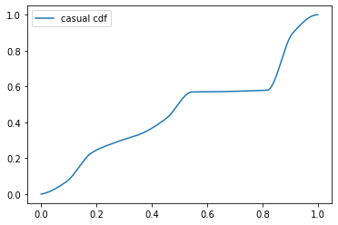
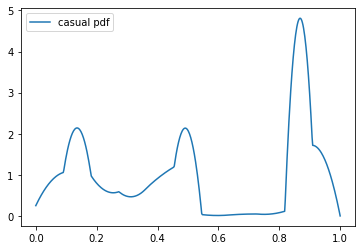
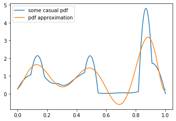
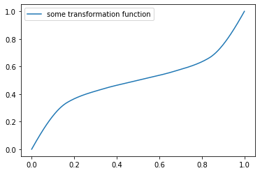
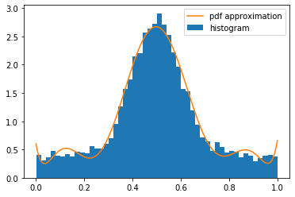

# Simple Python 3 code to realize algorythms of probability distribution functions approximations with various ways
Additional Python libs for execution:: 

- Matplotlib to draw graphs
- Numpy
- Scipy
- Math

_For Demonstration, here are layouts from Jupyter notebooks execution_

## Demo for moment-based approximating PDF with a set of Legender plolynomials

This is an adapted numerical calculation by method from book *"The Problem of Moments" J. A. Shohat, J. D. Tamarkin (Chapter III, p.90)*

```python
import numpy as np
import matplotlib.pyplot as plt
```

Used libs: pda_utils for manipulating with PDF/CDF and their statistics, lp_appx is for calculating of coefficient of expansion in Legendre polynomials that leads to probability distribution function estimation.   


```python
import pdf_appx.pda_utils as cd
import pdf_appx.lp_appx as lpappx
```

Define points of approximation in (0;1) and number of moments (by power, excluding zero power moment ==1) will be used for approximation:


```python
N = 500 
t= np.linspace(0,1,N)
num_moments=9
```

We have function that creates casual (nearly random) increasing fucntion that determines some CDF and PDF:


```python
getcdf = cd.casual_increasing_function()
print(type(getcdf))
```

    <class 'scipy.interpolate._cubic.PchipInterpolator'>
    


```python
Mycdf = getcdf(t)
plt.plot(t, Mycdf, label='casual cdf')
plt.legend()
plt.show()
```





```python
getpdf = getcdf.derivative(1)
Mypdf = getpdf(t)

plt.plot(t, Mypdf, label='casual pdf')
plt.legend()
plt.show()
```





Get moments of this function for Legendre polynomial expansion of PDF. Using of polynomials with big powers causes instability.


```python
num_moments=9
moments = cd.moments_from_cdf(getcdf,num_moments)

expansion_approx =     lpappx.approx_legendre_poly(moments)
pdf_approx = expansion_approx(t)

plt.plot(t, Mypdf, label='some casual pdf')    
plt.plot(t,pdf_approx, label='pdf approximation')
plt.legend()    
plt.show()
```





 Now create pdf approximation for the random data sample. We will use uniform distributed samples transformed by casual increasing function.


```python
gettransform = cd.casual_increasing_function()
Mytransform = gettransform(t)

plt.plot(t, Mytransform, label='some transformation function')
plt.legend()
plt.show()

samples_uni = np.random.rand(10000)
samples = gettransform(samples_uni)
```





Lets get expansion coefficients from estimation of moments


```python
moments2 = cd.moments_from_samples(samples, num_moments)
expansion_approx2 =     lpappx.approx_legendre_poly(moments2)
pdf_approx2 = expansion_approx2(t)

plt.hist(samples, bins=50, label = 'histogram', density = True) 
plt.plot(t,pdf_approx2, label='pdf approximation')
plt.legend()    
plt.show()
```




## Demo for estimation PDF with a "maximimum entropy maximization" method

This is a quite simple realization of method from article *"Maximum entropy in the problem of moments" by Lawrence R. Mead and N. Papanicolaou. J. Math. Phys. 25, 2404 (1984); doi: 10.1063/1.526446*
